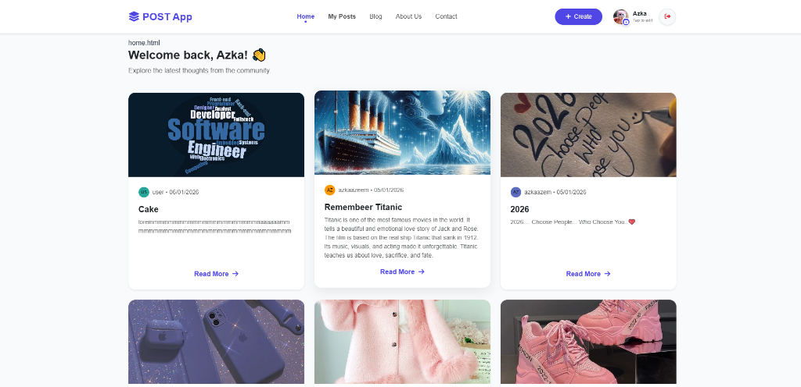
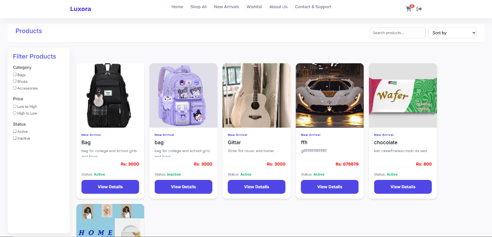

  

  <h3>I am a meticulous Frontend Developer and Creative Designer dedicated to crafting bespoke digital experiences.</h3>

---

### 👩‍💻 About Me

I blend technical precision with aesthetic elegance, ensuring every web application I build is not only high-performing but also visually captivating. With a keen eye for **UI/UX excellence**, I transform complex concepts into seamless, user-centric interfaces. I thrive on innovation and am constantly refining my craft to stay at the forefront of modern web standards.

- 💎 **Expertise:** Crafting responsive, high-performance web applications.
- 🎨 **Design Philosophy:** Minimalist, functional, and user-focused.
- 📈 **Current Focus:** Advanced React patterns & sophisticated Backend-as-a-Service (BaaS) integrations.

---

### 🚀 Tech Stack & Skills

  
  
  
  
  
  
  
  
   
  
  
  
  
  

---

### 🌟 Featured Projects

| **POST App (Mini Hackathon)** | **Luxora (Modern E-commerce)** |
| :---: | :---: |
|  |  |
| A dynamic social post application featuring user welcome screens and interactive feeds. | A full-stack style e-commerce platform with category filtering, cart logic, and modern UI. |
| [🔴 Live Demo](https://azkaazeem.github.io/Javascript-Mini-Hackathon/) | [🔴 Live Demo](https://azkaazeem.github.io/modern-fullstack-website/) |

---

### 📊 GitHub Stats

  
  

 

  

---

  

   
  <i>Let's connect and build something amazing together!</i>

