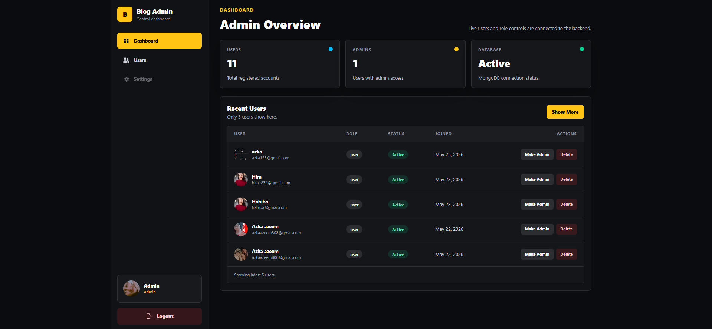
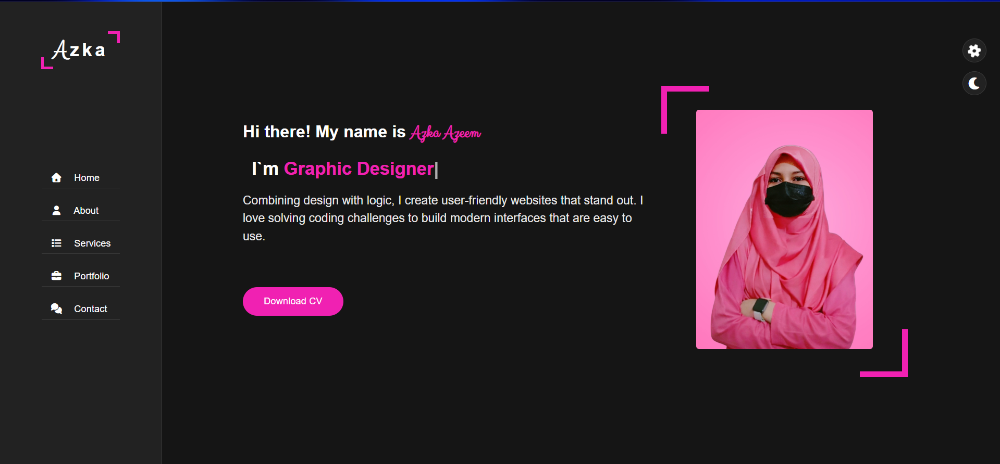

  <table cellpadding="4" cellspacing="0" align="center">
    <tr>
      <td>
      
        
        
      </td>
    </tr>
  </table>

  

   
  
  *Crafting modern, beautiful, and highly scalable web applications.* 🖤🩷

### &nbsp;**_About Me_**

&#128105;&#8205;&#128187; **I'm a Full-Stack (MERN) Developer & Graphic Designer** 
&#129504; **Experienced in:** HTML, CSS, Bootstrap, JavaScript (ES5/ES6), TypeScript, Supabase, React, Tailwind CSS 
&#128218; **Education:** High Achiever In Secondary Education, Currently learning O-Level in Science 
&#128272; **Specializing in:** Frontend Technologies, Backend Tools/Frameworks, and Design Tools 
&#127912; **Design Passion:** Crafting modern, responsive, and user-friendly web designs 
&#128640; **Currently Learning:** Mastering backend development and exploring **Agentic AI** on my journey. 
📬 **How to reach me:** [azkaazeem804@gmail.com](mailto:azkaazeem805@gmail.com)

 &nbsp;**_Skill Set & Expertise_**

<table align="center" style="width: 100%; border-collapse: collapse;">
  <tr align="center">
    <th width="25%"><b>Languages</b></th>
    <th width="25%"><b>Frontend & Frameworks</b></th>
    <th width="25%"><b>Backend / Database</b></th>
    <th width="25%"><b>Creative & Design</b></th>
  </tr>
  <tr align="center" valign="top">
    <td>
       
        
        
        
        
      
    </td>
    <td>
       
        
        
        
      
    </td>
    <td>
       
        
        
        
        
        
      
    </td>
    <td>
       
        
        
        
        
      
    </td>
  </tr>
</table>

&nbsp;**_Featured Projects_**

  <table border="0" width="100%" align="center">
    <!-- <tr>
      <td width="50%" align="center">
        <h3>✨ Project 1: MERN Application</h3>
        
A full-stack modern solution built with React, Node, and MongoDB.

         
        
        
      </td>
      <td width="50%" align="center">
        <h3>✨ Project 2: UI/UX Masterpiece</h3>
        
A stunning, user-friendly frontend design system.

         
        
        
      </td>
    </tr>
    <tr>
      <td width="50%" align="center">
        <h3>✨ Project 3: Agentic AI Assistant</h3>
        
A Python-based AI tool to automate tasks intelligently.

         
        
        
      </td>
      <td width="50%" align="center">
        <h3>✨ Project 4: Full-Stack Dashboard</h3>
        
Data visualization using React, Tailwind CSS, and Database.

         
        
        
      </td>
    </tr>-->
        <tr>
      <td width="50%" align="center">
        <h3>✨ Project 1: Complete Authentication and CRUD</h3>
        
----------

        
         
        
        
      </td>
      <td width="50%" align="center">
        <h3>✨ Project 2: My personal portfolio</h3>
        
----------

        
         
        
        
      </td>
    </tr> -->
  </table>

&nbsp;**_GitHub Stats & Activity_**

 

  
  

 

  

 

  
  

 

  
  

 

  

 
 
 

  
  

<!-- 

&nbsp;***Contribution Snake***

  <picture>
    <source media="(prefers-color-scheme: dark)" srcset="https://raw.githubusercontent.com/Azkaazeem/Azkaazeem/output/github-contribution-grid-snake-dark.svg">
    <source media="(prefers-color-scheme: light)" srcset="https://raw.githubusercontent.com/Azkaazeem/Azkaazeem/output/github-contribution-grid-snake.svg">
    
  </picture>

 -->

  

