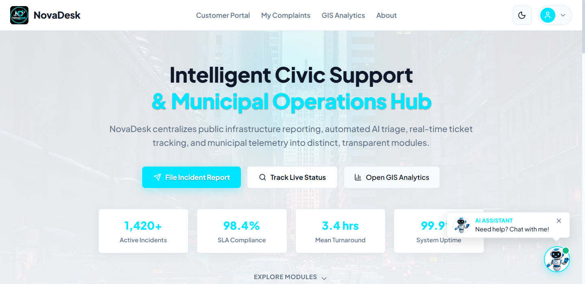
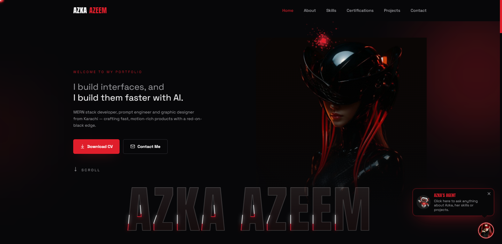

 
  

    
   

  

    
   

  

    
    
    
  

   

  

    <em>Architecting scalable web applications, robust backend systems, and intelligent AI workflows.</em>
  

   
 

  

 

### &nbsp;**_About Me_**

Full-Stack Developer, Prompt Engineer, and UI/UX Designer dedicated to building high-performance web applications and intuitive digital experiences.

- $\color{#FF5CA8}\textbf{Core Specialization:}$ Full-Stack Web Development (MERN Stack) & Agentic AI Architecture
- $\color{#00D2FF}\textbf{Frontend Engineering:}$ React.js, TypeScript, Next.js, Redux Toolkit, Tailwind CSS
- $\color{#A371F7}\textbf{Backend and Databases:}$ Node.js, Express.js, MongoDB, PostgreSQL, Supabase, RESTful APIs
- $\color{#00F5D4}\textbf{Artificial Intelligence:}$ Prompt Engineering, Autonomous AI Agents, LLM Orchestration
- $\color{#FF85A1}\textbf{UI/UX and Creative Suite:}$ Figma, Adobe Photoshop, Adobe Illustrator, Canva
- $\color{#FFD166}\textbf{Education and Credentials:}$ O-Level in Science; Professional tracks with SMIT, Panaversity, and Cisco
- $\color{#4CC9F0}\textbf{Location:}$ Karachi, Pakistan
- $\color{#F72585}\textbf{Languages:}$ English (Professional Proficiency), Urdu (Native)

 

### &nbsp;**_Tech Stack & Tooling_**

#### Frontend Development

  
  
  
  
  
  
  
  

#### Backend & Databases

  
  
  
  
  
  

#### AI & Intelligent Systems

  
  
  

#### UI/UX & Creative Suite

  
  
  
  

#### DevOps & Tools

  
  
  
  

 

### &nbsp;**_Certifications & Training_**

| Certification | Issuing Organization | Credential |
| :--- | :--- | :--- |
| **Introduction to Modern AI** | Cisco Networking Academy |  |
| **JavaScript Essentials 1 & 2** | Cisco Networking Academy / JS Institute |  |
| **HTML & CSS Essentials** | Cisco Networking Academy |  |
| **Techno Kids (Batch-6) — Basic Computer Course** | Saylani Mass IT Training (SMIT) |  |

 

### &nbsp;**_Featured Projects_**

#### 01. NovaDesk — AI Civic Support & Municipal Operations Hub
> Full-stack civic management platform built for MERN Hackathon 2026. Features automated AI triage, real-time ticket tracking, GIS municipal telemetry, and an integrated interactive AI Assistant chatbot for instant citizen resolution.

  
  
  
  
  
  

  

  
  &nbsp;
  

 

#### 02. Full-Stack Developer Portfolio & Autonomous AI Agent Hub
> High-performance developer portfolio featuring a motion-rich red-on-black cyberpunk interface, smooth reactive architecture, and an embedded autonomous AI Agent ("Azka's Agent") capable of answering questions about skills, credentials, and projects in real time.

  
  
  
  
  

  

  
  &nbsp;
  

 

### &nbsp;**_GitHub Analytics & Activity_**

  
  &nbsp;
  

 

  

 

### &nbsp;**_Contribution Snake_**

  

 

### &nbsp;**_Connect & Collaborate_**

  
Interested in collaborating or discussing full-stack and AI opportunities? Feel free to connect.

  

    
    &nbsp;
    
    &nbsp;
    
  

   
   

  

 